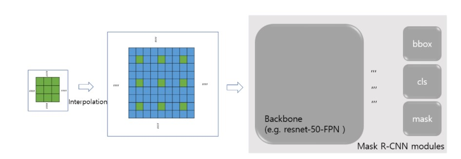

### Mask rcnn transfrom layer Interpolation experiments

Before Image goes into mask rcnn backbone module , image is resized to fixed size to get good features. 
When resizing image, generally Bilinear interpolation is used.
There're many kind of interpolation methods to resize in this repository code. 




## train
### main options
- --dt : dataset

    - pf  : pennFudan
    - bln : balloon
    
- --model  : interpolation method

    - bicubic (👍)
    - bilinear
    - nearest


> Usage

```{.bash}  
python train.py --dt pf --model  bicubic -o ./model/something.pth
```


### Secondary options 

- --out     : default = './model/new.pth'

- --epochs  : default = 50
- --batch   : default = 4
- --device  : default = 'cuda:0'
- --workers : default = 4 


## Evaluate
About model itself 
- the number of parameter 
About performance
- mAP
    - mask
    - bbox

> Jupyter (interactive)  

: evaluate.ipynb 

> Shell

```python:howtoevaluate
python evaluate.py -m /path/to/modelA.pth /path/to/modelB.pth -o /where/to/save/figure_dir
```
### option
- -m ,--model (default) ./models/*.pth 
- -o ,--output (default) false (false : prints evaluation results on console, true : saves graph images in ./results directory )

e.g )
```python:howtoevaluate
python evaluate.py 
python evaluate.py -m /path/to/modelA.pth /path/to/modelB.pth -o true
python evaluate.py -o true
python evaluate.py -m /path/to/modelA.pth /path/to/modelB.pth 
```
<!-- 
 output : modelName_ap_epochs.jpg , modelName_ap_table.jpg
-->
## Inference

## ETC

> **reference**

